---
title: "Mapes virtuals interactius"
author: [CEFIRE DE VALÈNCIA]
date: "03-01-2023"
subject: "Proxmox"
keywords: [Xarxa, Instal·lació]
subtitle: "Curs a distància 22VA88IN005"
lang: "es"
page-background: "background10.pdf"
titlepage: true,
titlepage-rule-color: "360049"
titlepage-background: "background10.pdf"
colorlinks: true
toc: true
toc-own-page: true
header-includes:
- |
  ```{=latex}
  \usepackage{awesomebox}
  \usepackage{caption}
  \usepackage{array}
  \usepackage{tabularx}
  \usepackage{ragged2e}
  \usepackage{multirow}

  ```
pandoc-latex-environment:
  noteblock: [note]
  tipblock: [tip]
  warningblock: [warning]
  cautionblock: [caution]
  importantblock: [important]
...

<!-- \awesomebox[violet]{2pt}{\faRocket}{violet}{Lorem ipsum…} -->

\vspace*{\fill}

{ height=50px }

Aquest document està subjecte a una llicència creative commons que permet la seua difusió i ús comercial reconeixent sempre l'autoria del seu creador. Aquest document es troba per a ser modificat al següent repositori de github:
<!-- CANVIAR L'ENLLAÇ -->
[https://github.com/alviboi/tasca12dua](https://github.com/alviboi/tasca12dua)
\newpage

# Introducció

Existeixen moltíssimes ferramentes per a crear mapes virtuals, moltes d'elles són de pagament i en anglès, i francament molt bones i que ens poden ajudar a plantejar diverses situacions d'aprenentatge. 

Però, ara bé. Paga la pena pagar? La resposta és sí, però caldrà que veges en totes les situacions quina és la que millor s'adapta al que nosaltres volem transmetre a l'aula. En la majoria del les situacions en les que ens trobarem a les ferramentes que trobem de manera gratuïta en tindrem bastant.

Les ferramentes que anem a tractar en este curs són 3:

* Mapifator
* Proxi

Totes elles tenen plans gratuïts que seran en la major part suficients per al que volem plantejar.

# Mapifator

Mapifator és una ferramenta que ens permet fer mapes interactius i compartir-los a internet, a més de donar-lo diverses funcionalitats. Presenta molts avantatges ja que ens permet crear un ruta en un plànol amb indicacions i botons per a saber més informació. A més ens permet crear una descripció addicional que ens pot servir per a crear activitats.

El gran inconvenient que presenta aquesta publicació és que només permet crear un mapa i aquest només pot ser visualitzat 1000 vegades per mes. Que per a crear una situació d'aprenentatge per a una classe probablement siga bastant, però no deixa de ser escàs.

## Exemple de creació d'un plànol en Mapifator

Anem a explicar els diferents procediments per a crear un plànol en Mapifator tenint en compte totes les opcions. El primer que hem de fer per a poder accedir és anar a la [pàgina web](https://mapifator.com/). I Registrar-nos:


Ens demanarà que verifiquem el correu:


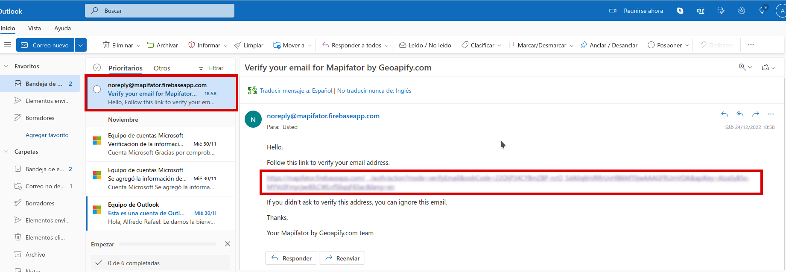

Una vegada hem verificat ens apareixerà la pantalla per a poder començar a crear el plànol. Definim les nostres opcions per a continuar:

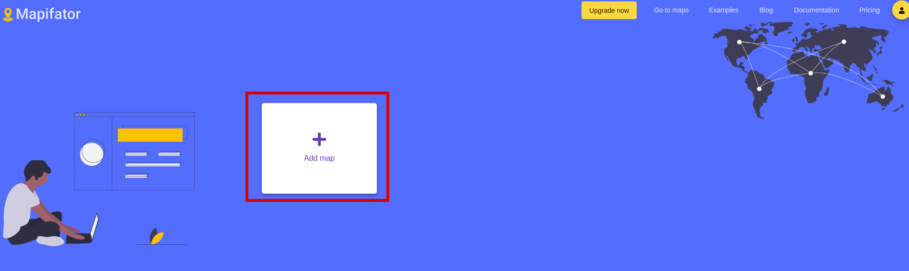


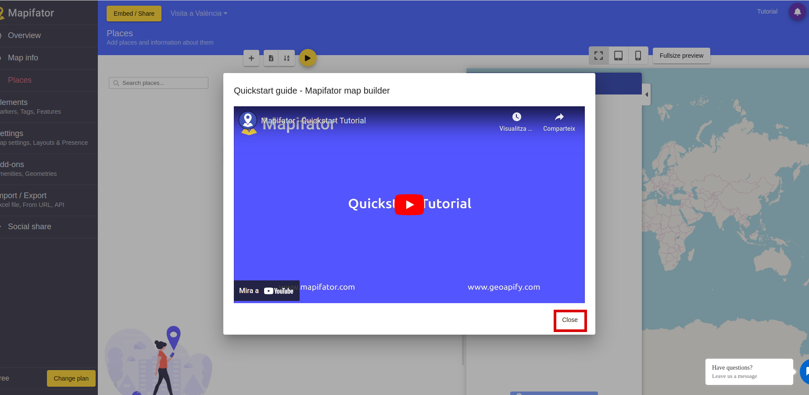

Aquesta és pantalla de disseny, la part que tenim destacada és on definirem els aspectes generals del plànol que anem a dissenyar. En aquest cas anem a farem com a exemple una visita breu a València:

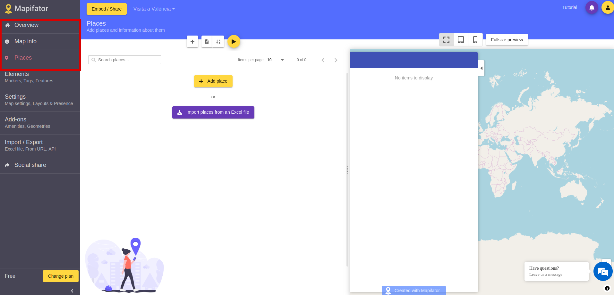

### Descripció general

Per a canviar la descripció general del plànol, al començament canviarem dues coses:

* Overview: És on es posarà el nom del plànol
* Map info: On es detallaran algunes de les explicacions del plànol.

A overview:


Després en Map info hem de canviar quin serà el disseny de la pàgina d'introducció on podrem posar una imatge representativa i una descripció.

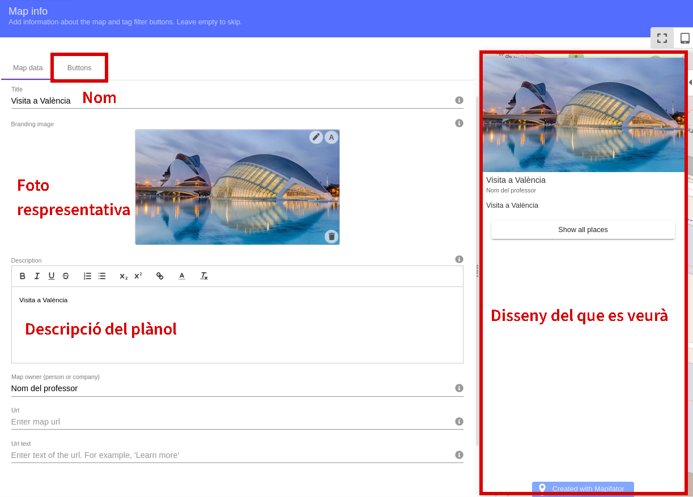

Caldrà canviar el títol del botó per a mostrar les ubicacions:

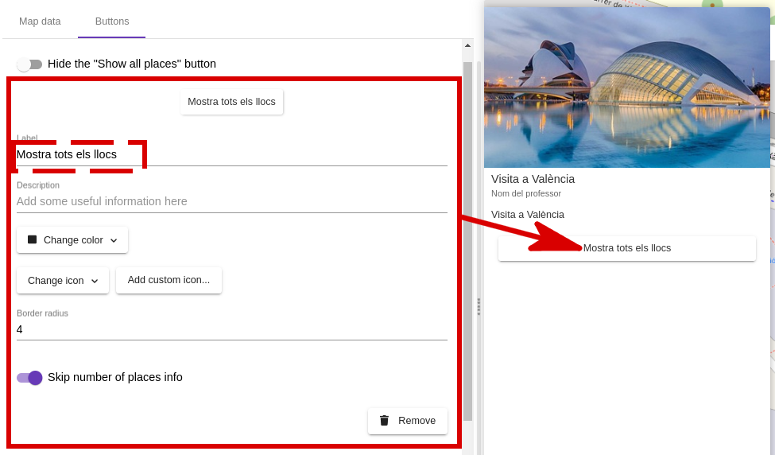

### Features

Abans de continuar es important definir el element addicional que acompanyarà a les descripcions de cada un del llocs.


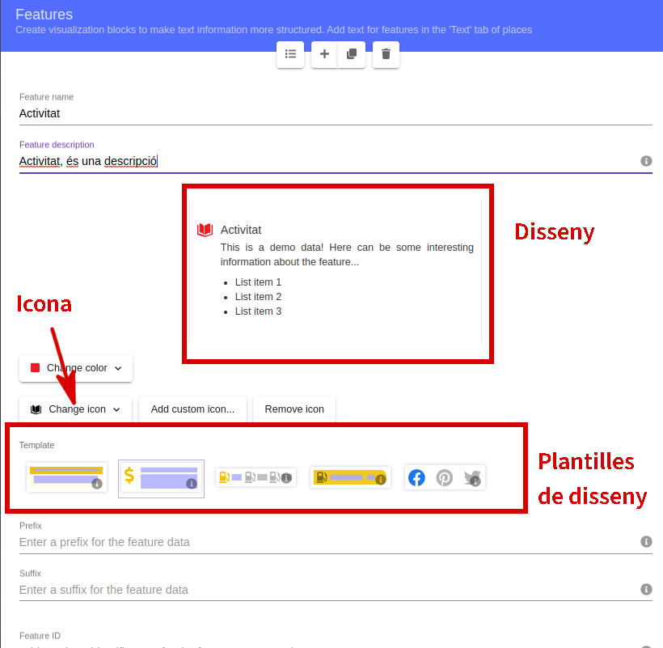

Cada lloc que anem a senyalar al map anirà acompanyat d'una descripció. Aquesta descripció té un disseny predefinit. Amb aquest apartat estem dissenyant quins elements addicionals volem que apareguen dins de cada punt d'informació al plànol.

### Punts d'informació.

Aquesta és la part més important del disseny ja que afegirem els punt del plànol per on dissenyat la nostra visita. A mode d'exemple explicarem detalladament un dels punts.

En primer lloc quan entrem i abans de definir res ja ens trobarem en l'apartat *places*, di definim els aspectes generals abans podem tornar anant a *Places* a la barra de navegació. Ens trobarem un espai on definirem en primer llocs els següents aspectes:

* Nom del lloc
* Coordenades del lloc: per a poder seleccionar al mapa el lloc hem de desactivar el cadenat i fer doble click a qualsevol lloc del mapa. Podem anar augmentant o disminuint el mapa. També podem posar directament l'adreça.


Posteriorment posarem una descripció dins de la pestanya *text*. Podem veure que ens apareix un segon calaix on posarem el text del *feature* que hem afegit.

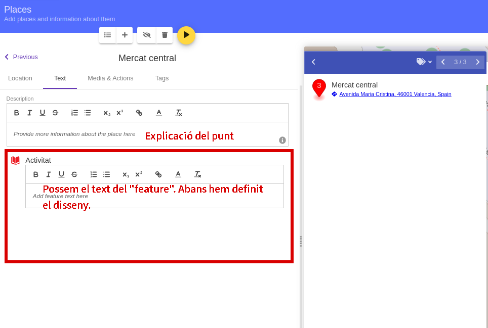


En *media & actions* podem afegir elements addicionals a la descripció:

* Una imatge destacada del lloc
* Un botó que ens òbriga una altra pàgina

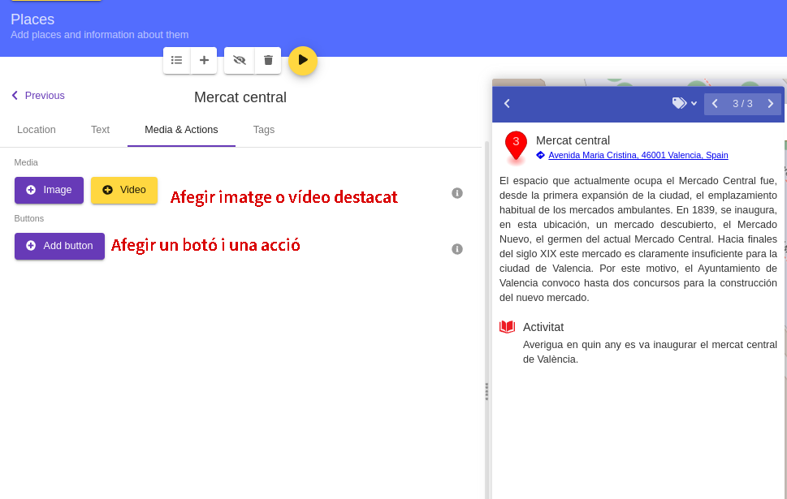

Al afegir botó hem de definir el text i la pàgina que volem que ens òbriga:


Podem veure com quedaria el disseny a la següent imatge:

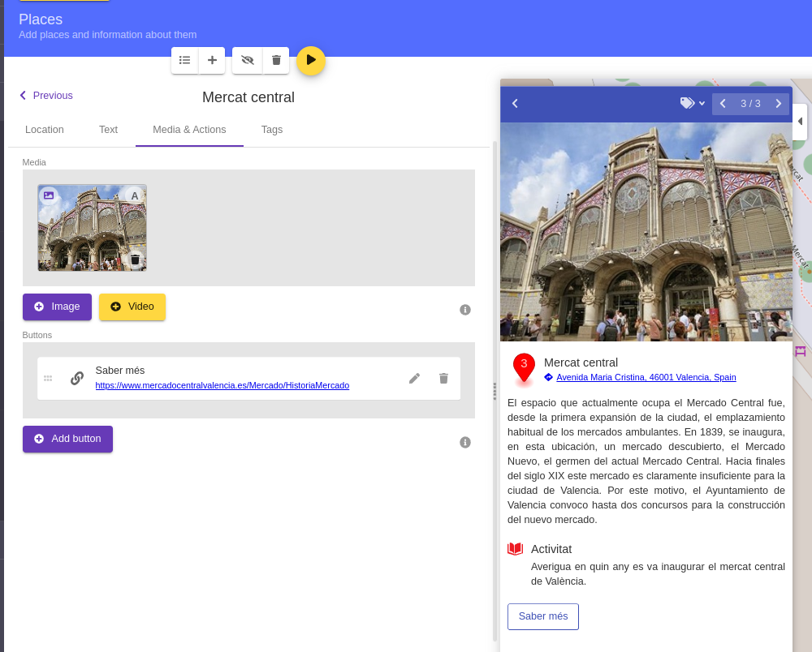

Una vegada hem afegit els elements. Ja tindríem definit el disseny d'eixe lloc. Si volguéssim afegir altre element caldria que férem click sobre el + per repetir el procés.

### Navegació

Si volem anar veient com va quedant cada un del llocs als diferents dispositius tenim la següent barra de previsualització en funció del dispositiu on es visualitzara:

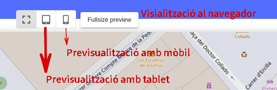


# Proxi

Proxi és una ferramenta que també ens permetrà crear mapes interactius. La versió gratuïta de Proxi té poques limitacions i ens permet aprofitar tot el seu potencial. És molt més senzilla però per a crear mapes interactius sense limitacions que ens poden ajudar en el disseny de les nostres situacions d'aprenentatge. En aquest cas ens centrarem en l'apartat de mapes però aquesta ferramenta té un potencial molt més gran.

## Exemple de creació

En aquest cas anem a basar-nos en el mateix exemple que abans però el procediments és un tant diferent. Per a poder accedir hem d'anar a la seua [pàgina web](https://es.proxi.co/). I anem a l'apartat entrar on es trobarem la següent pantalla:

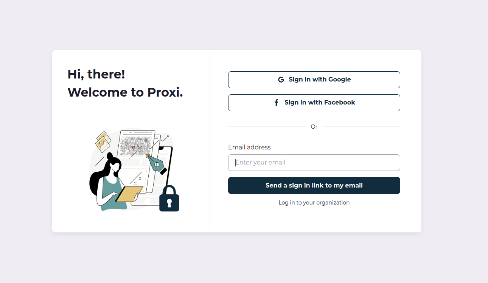

Una vegada t'inscrigues t'apareixerà la següent pantalla i caldrà que vages al teu correu que et donarà un link per a poder entrar a la plataforma:


Una vegada fas clic et portarà a la plataforma:


En aquest moment li fem click a Start a new map i ens apareixerà la pantalla per a poder editar els diferents elements. El primer que hem de fer es posar el lloc on volem fer el plànol:

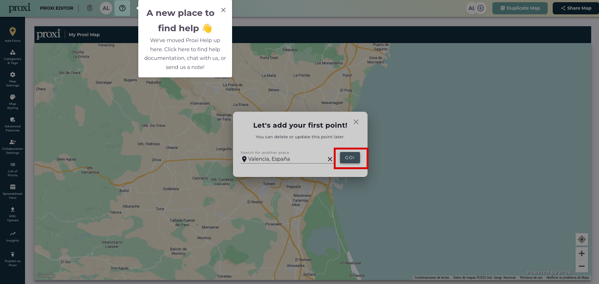

Una vegada fem clic a *Go* ens apareixerà la pantalla de benvinguda i un xicotet tutorial que podem obviar. Per a poder afegir un punt fem doble clic al mapa i ens apareixerà el següent diàleg:


Hem d'emplenar els següents punts:

* Details: on posarem en nom.
* Actions: en aquest lloc posarem l'enllaç del lloc per a que ens done més informació del punt.
* Foto: foto significativa del lloc.


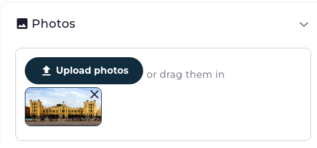

Una vegada tenim fet en nostre punt, ens apareixerà una previsualització on les ferramentes d'admin no ens apareixeran quan publiquen el mapa. Des d'ací podem tornar a editar aquest lloc.

Aquest procés el repetim per a tots els punts que volem definir.

## Definició del plànol

Abans de publicar és important definir dos punts. Dins de *map settings* en default map zoom escollim l'opció "15 - Neigborhood". Aquesta opció ens permetrà veure per defecte el plànol a una mida adequat.


Després en *Adavanced features* al final seleccionarem les opcions de *Enable point numbering* i *Replace map icons with numbers*. D'aquesta manera podrem veure al plànol els punts numerats. D'altra manera ho podem deixar tal i com està.


## Publicació

Finalment li donem a *Publish to proxi* per a poder publicar en plànol i fem clic en *Save*.

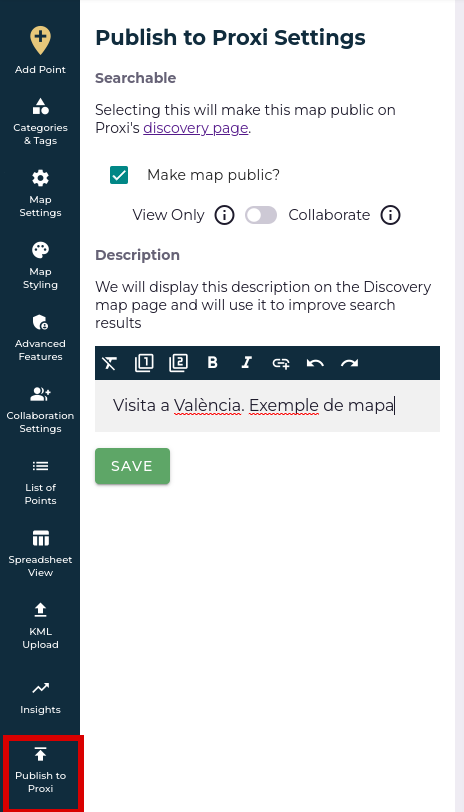

Una vegada fet això fem clic en *Share map* i ens apareixerà la següent finestra on podrem copiar l'enllaç per a que altre puguen veure els nostre plànol:


# Bibliografia

(@) [https://map.proxi.co/](https://map.proxi.co/)
(@) [https://mapifator.com](https://mapifator.com)