---
title: "Mapas virtuales interactivos"
author: [CEFIRE DE VALÈNCIA]
date: "03-01-2023"
subject: "Proxmox"
keywords: [Xarxa, Instal·lació]
subtitle: "Curso a distancia 22VA88IN005"
lang: "es"
page-background: "background10.pdf"
titlepage: true,
titlepage-rule-color: "360049"
titlepage-background: "background10.pdf"
colorlinks: true
toc: true
toc-own-page: true
header-includes:
- |
  ```{=latex}
  \usepackage{awesomebox}
  \usepackage{caption}
  \usepackage{array}
  \usepackage{tabularx}
  \usepackage{ragged2e}
  \usepackage{multirow}

  ```
pandoc-latex-environment:
  noteblock: [note]
  tipblock: [tip]
  warningblock: [warning]
  cautionblock: [caution]
  importantblock: [important]
...

<!-- \awesomebox[violet]{2pt}{\faRocket}{violet}{Lorem ipsum…} -->

\vspace{\hijo}

{ height=50px }

Este documento está sujeto a una licencia creative commons que permite su difusión y uso comercial reconociendo siempre la autoría de su creador. Este documento se encuentra para ser modificado en el siguiente repositorio de github:
<!-- CANVIAR L'ENLLAÇ -->
[https://github.com/alviboi/tasca12dua](https://github.com/alviboi/tasca12dua)
\newpage

# Introducción

Existen muchísimas herramientas para crear mapas virtuales, muchas de ellas son de pago y en inglés, y francamente muy buenas y que nos pueden ayudar a plantear varias situaciones de aprendizaje. 

Pero, ahora bien. Paga la pena pagar? La respuesta es sí, pero hará falta que veas en todas las situaciones qué es la que mejor se adapta al que nosotros queremos transmitir al aula. En la mayoría del las situaciones en las que nos encontraremos a las herramientas que encontramos de manera gratuita  tendremos bastante.

Las herramientas que vayamos a tratar en este curso son 3:

* Mapifator
* Proxi

Todas ellas tienen planes gratuitos que serán en la mayor parte suficientes para el que queremos plantear.

# Mapifator

Mapifator es una herramienta que nos permite hacer mapas interactivos y compartirlos a internet, además de darlo varias funcionalidades. Presenta muchas ventajas puesto que nos permite crear un ruta en un plano con indicaciones y botones para saber más información. Además nos permite crear una descripción adicional que nos puede servir para crear actividades.

El gran inconveniente que presenta esta publicación es que solo permite crear un mapa y este solo puede ser visualizado 1000 veces por mes. Que para crear una situación de aprendizaje para una clase probablemente sea bastante, pero no deja de ser escaso.

## Ejemplo de creación de un plano en Mapifator

Vayamos a explicar los diferentes procedimientos para crear un plano en Mapifator teniendo en cuenta todas las opciones. El primero que tenemos que hacer para poder acceder es ir a la [página web](https://mapifator.com/). Y Registrarnos:

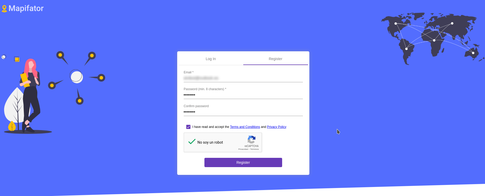

Nos pedirá que verifiquemos el correo:

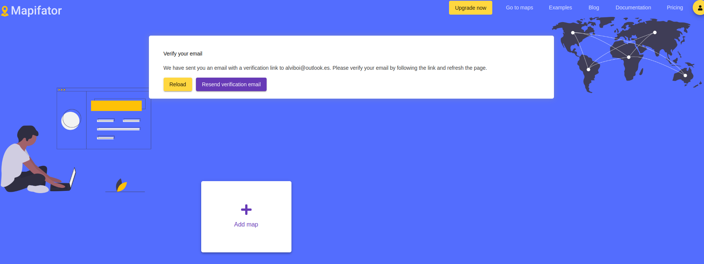

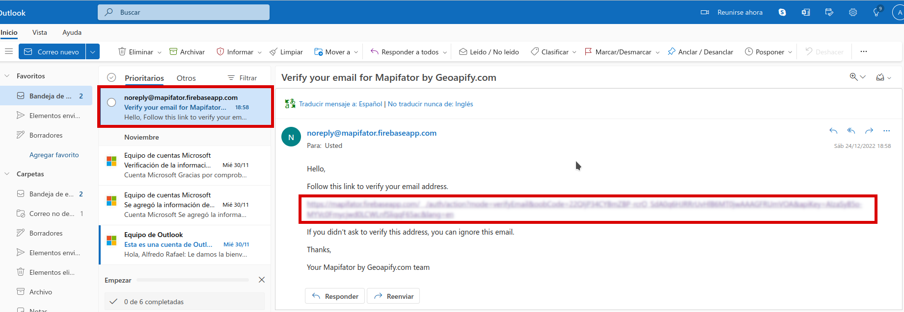

Una vez hemos verificado nos aparecerá la pantalla para poder empezar a crear el plano. Definimos nuestras opciones para continuar:

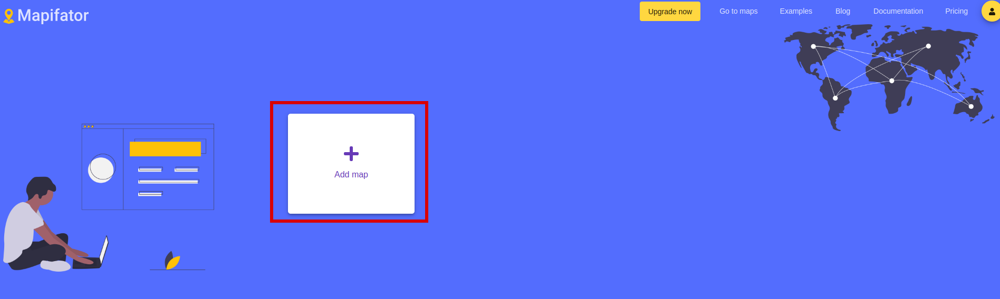

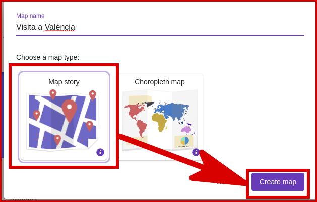

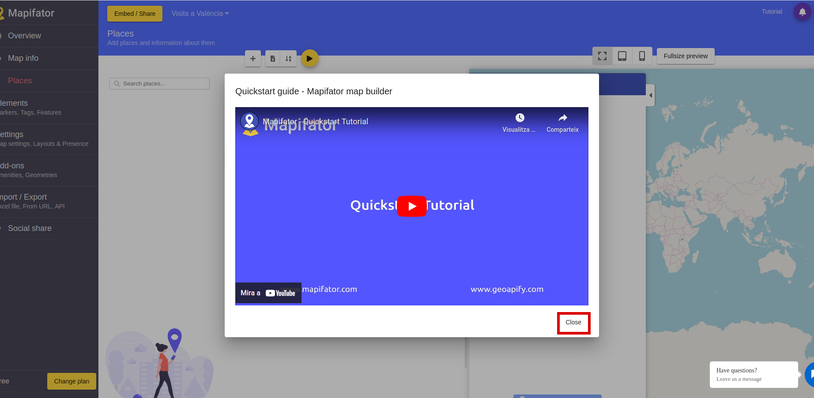

Esta es pantalla de diseño, la parte que tenemos destacada es donde definiremos los aspectos generales del plano que vayamos a diseñar. En este caso vayamos a haremos como ejemplo una visita breve en València:

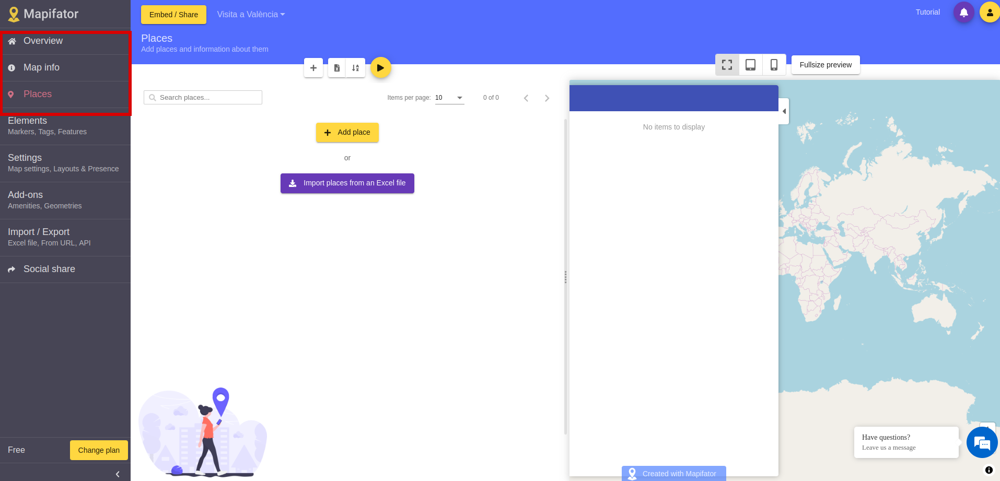

### Descripción general

Para cambiar la descripción general del plano, al comienzo cambiaremos dos cosas:

* Overview: Es donde se posará el nombre del plano
* Map info: Donde se detallarán algunas de las explicaciones del plano.

A overview:

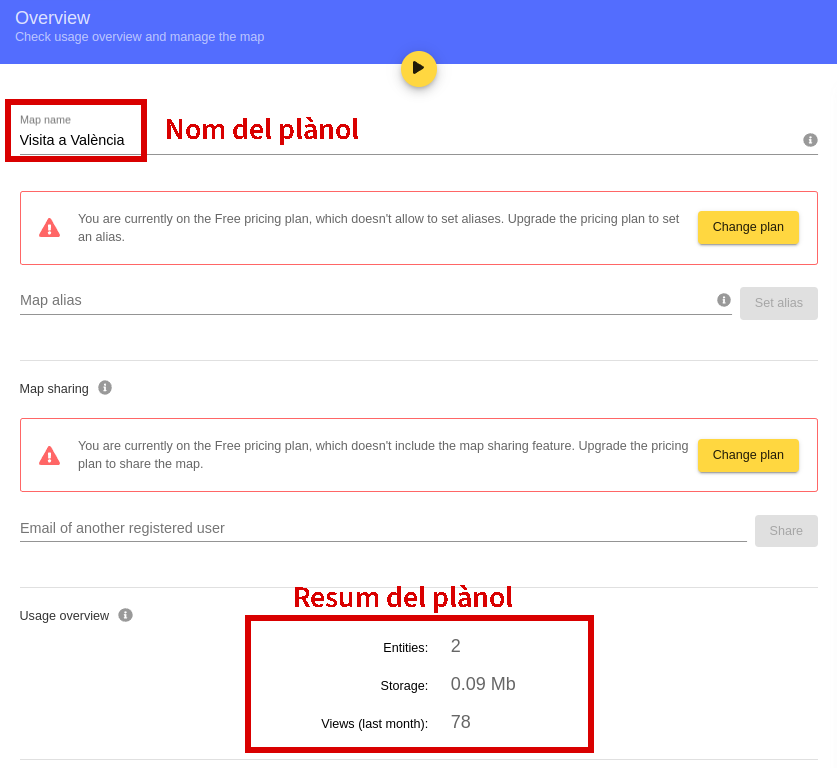

Después en Map info tenemos que cambiar cuál será el diseño de la página de introducción donde podremos posar una imagen representativa y una descripción.

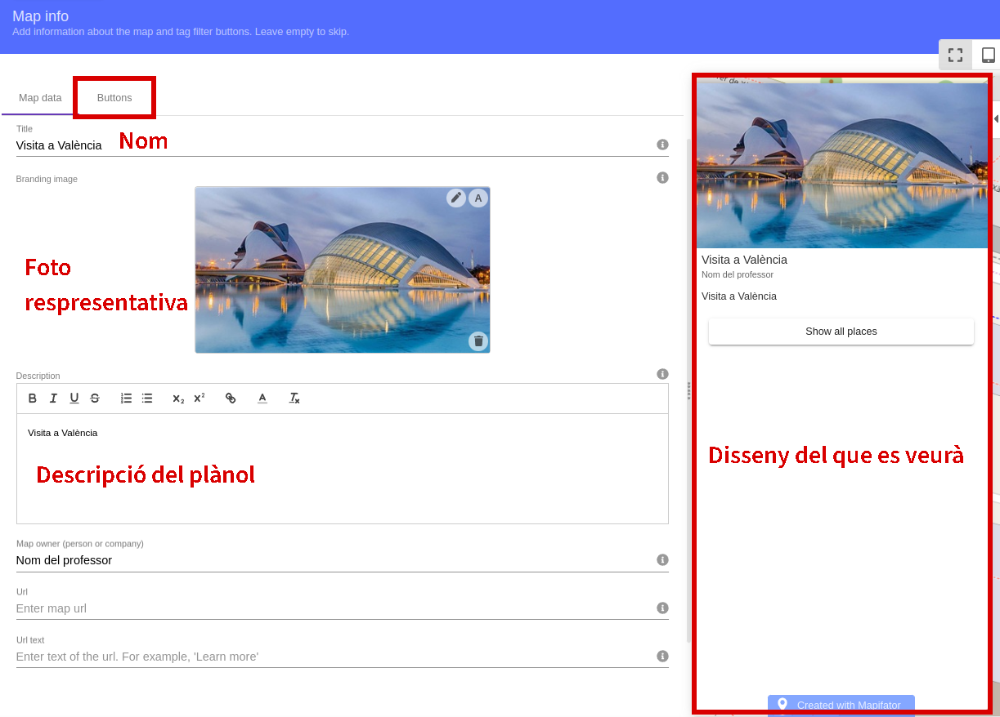

Habrá que cambiar el título del botón para mostrar las ubicaciones:

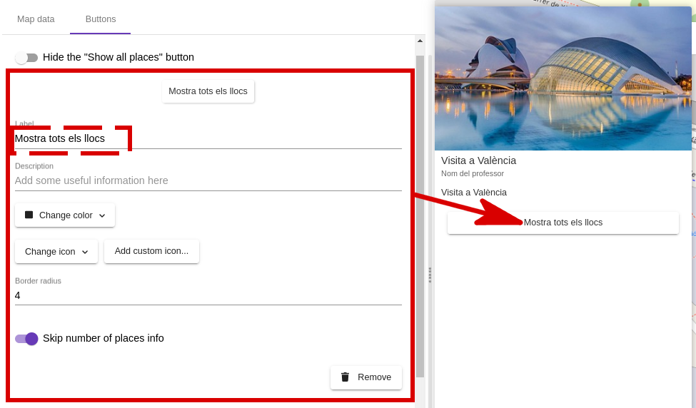

### Features

Antes de continuar se importando definir el elemento adicional que acompañará a las descripciones de cada uno del lugares.

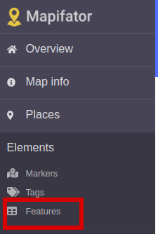

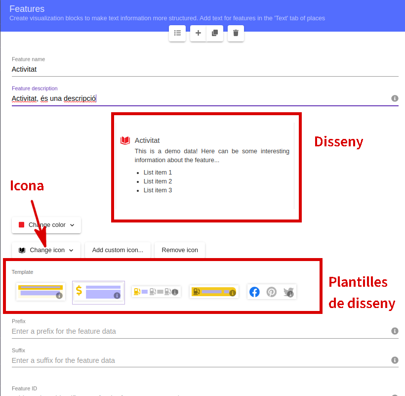

Cada lugar que vayamos a señalar al map irá acompañado de una descripción. Esta descripción tiene un diseño predefinido. Con este apartado estamos diseñando qué elementos adicionales queremos que aparezcan dentro de cada punto de información al plano.

### Puntos de información.

Esta es la parte más importante del diseño puesto que añadiremos los punto del plano por donde diseñado nuestra visita. A modo de ejemplo explicaremos en detalle uno de los puntos.

En primer lugar cuando entramos y antes de definir nada ya nos encontraremos en la apartado plazas*, di definimos los aspectos generales antes podemos volver yendo a Plazas* a la barra de navegación. Nos encontraremos un espacio donde definiremos en primero lugares los siguientes aspectos:

* Nombre del lugar
* Coordenadas del lugar: para poder seleccionar al mapa el lugar tenemos que desactivar el candado y hacer doble click a cualquier lugar del mapa. Podemos ir aumentando o disminuyendo el mapa. También podemos posar directamente la dirección.


Posteriormente posaremos una descripción dentro de la pestaña texto*. Podemos ver que nos aparece un segundo cajón donde posaremos el texto del *feature* que hemos añadido.

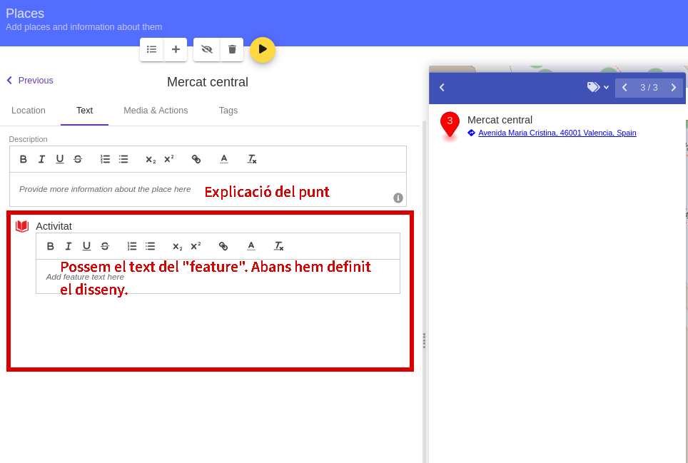

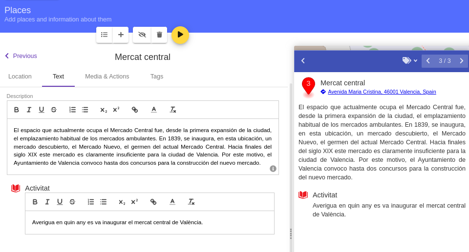

 media & actions* podemos añadir elementos adicionales a la descripción:

* Una imagen destacada del lugar
* Un botón que nos abra otra página

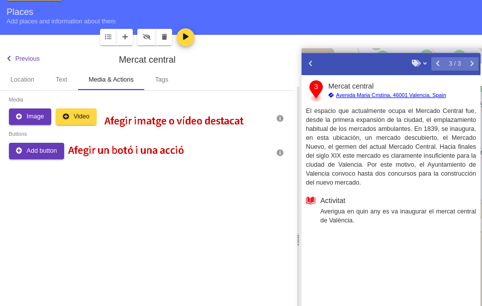

Al añadir botón tenemos que definir el texto y la página que queremos que nos abra:

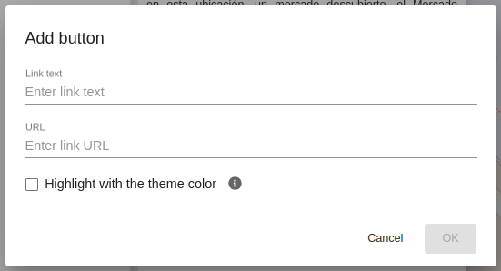

Podemos ver como quedaría el diseño a la siguiente imagen:

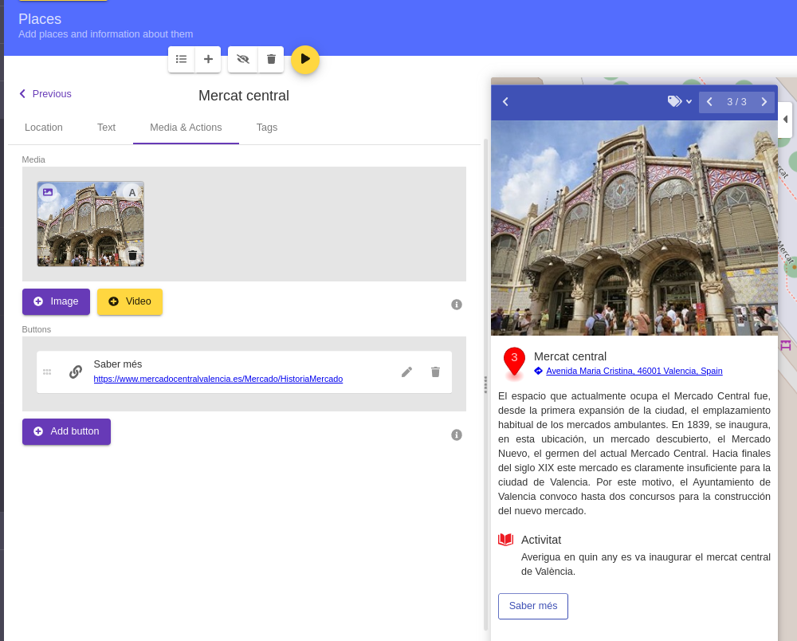

Una vez hemos añadido los elementos. Ya tendríamos definido el diseño de ese lugar. Si quisiéramos añadir otro elemento haría falta que hicimos click sobre el + para repetir el proceso.

### Navegación

Si queremos ir viendo como va quedando cada uno del lugares a los diferentes dispositivos tenemos la siguiente barra de previsualización en función del dispositivo donde se visualizara:

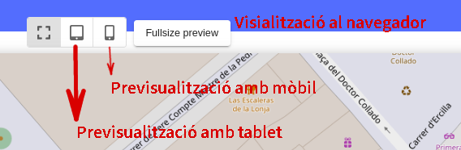


# Proxi

Proxi es una herramienta que también nos permitirá crear mapas interactivos. La versión gratuita de Proxi tiene pocas limitaciones y nos permite aprovechar todo su potencial. Es mucho más sencilla pero para crear mapas interactivos sin limitaciones que nos pueden ayudar en el diseño de nuestras situaciones de aprendizaje. En este caso nos centraremos en el apartado de mapas pero esta herramienta tiene un potencial mucho más grande.

## Ejemplo de creación

En este caso vayamos a basarnos en el mismo ejemplo que antes pero el procedimientos es un tanto diferente. Para poder acceder tenemos que ir a lo suyo [página web](https://es.proxi.co/). Y vamos al apartado entrar donde se encontraremos la siguiente pantalla:

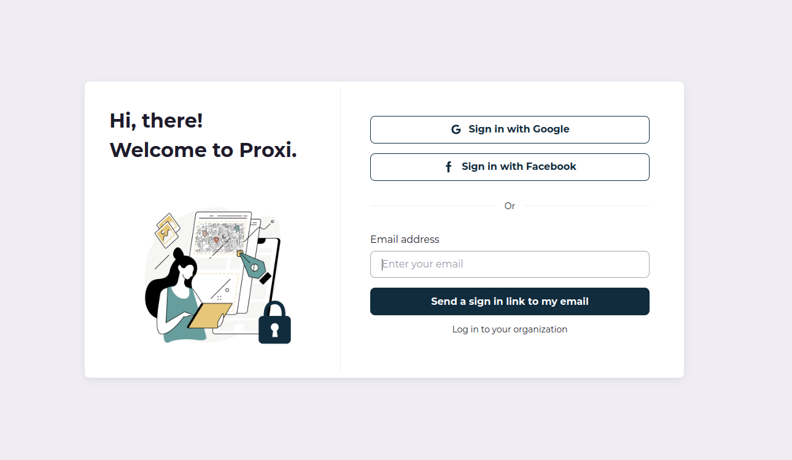

Una vez te inscribas te aparecerá la siguiente pantalla y hará falta que vayas a tu correo que te dará un link para poder entrar a la plataforma:

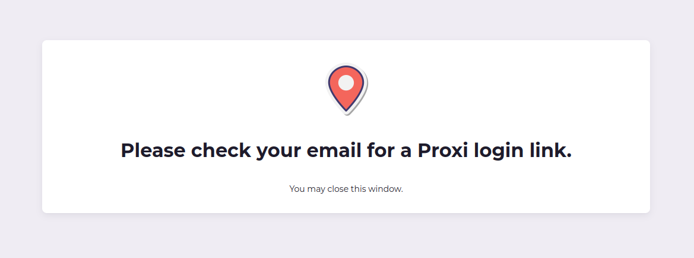

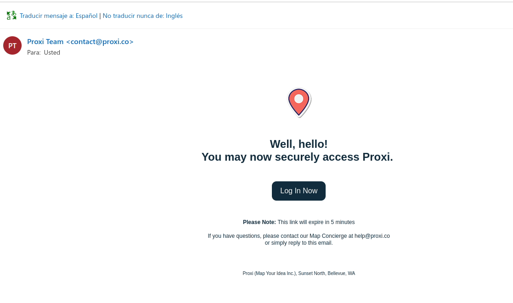

Una vez haces clic te llevará a la plataforma:

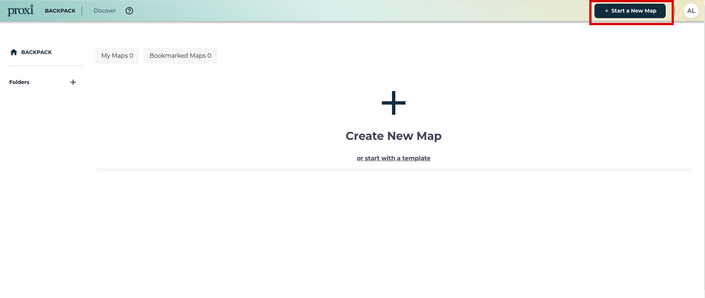

En este momento le hacemos click a Start a new map y nos aparecerá la pantalla para poder editar los diferentes elementos. El primero que tenemos que hacer se posar el lugar donde queremos hacer el plano:

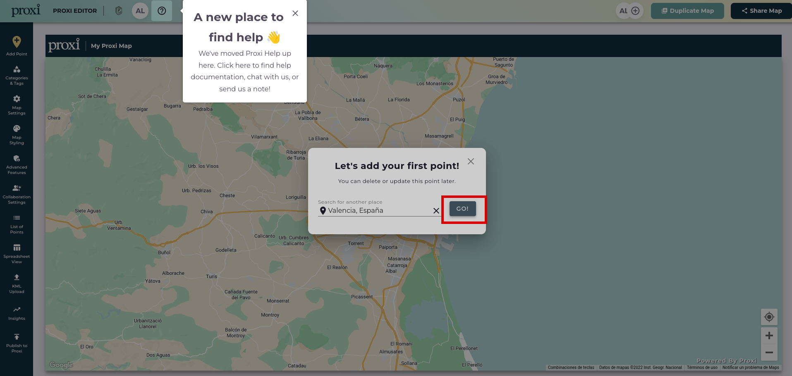

Una vez hacemos clic a *Go* nos aparecerá la pantalla de bienvenida y un pequeño tutorial que podemos obviar. Para poder añadir un punto hacemos doble clic al mapa y nos aparecerá el siguiente diálogo:

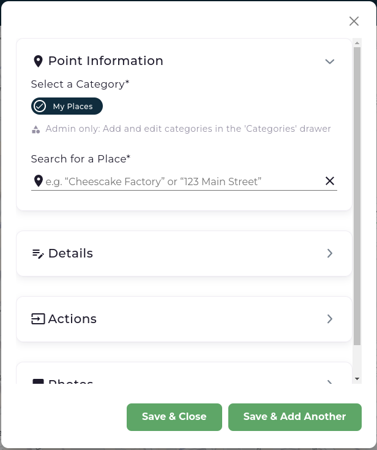

Tenemos que rellenar los siguientes puntos:

* Details: donde posaremos en nombre.
* Actions: en este lugar posaremos el enlace del lugar para que nos doy más información del punto.
* Foto: foto significativa del lugar.

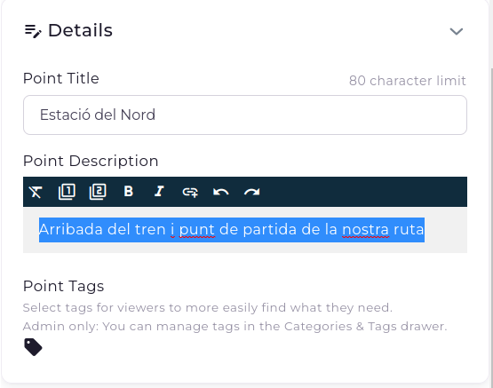

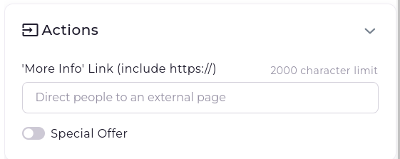

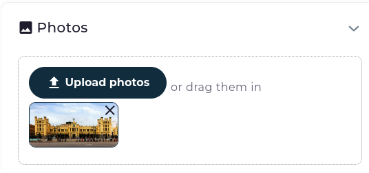

Una vez tenemos hecho en nuestro punto, nos aparecerá una previsualización donde las herramientas de admin no nos aparecerán cuando publican el mapa. Desde aquí podemos volver a editar este lugar.

Este proceso lo repetimos para todos los puntos que queremos definir.

## Definición del plano

Antes de publicar es importante definir dos puntos. Dentro de *map settings* en default map zoom escogemos la opción "15 - Neigborhood". Esta opción nos permitirá ver por defecto el plano a una medida adecuado.


Después en *Adavanced features* al final seleccionaremos las opciones de *Enable point numbering* y *Replace map icons with numbers*. De este modo podremos ver al plano los puntos numerados. De otra manera lo podemos dejar tal y como está.

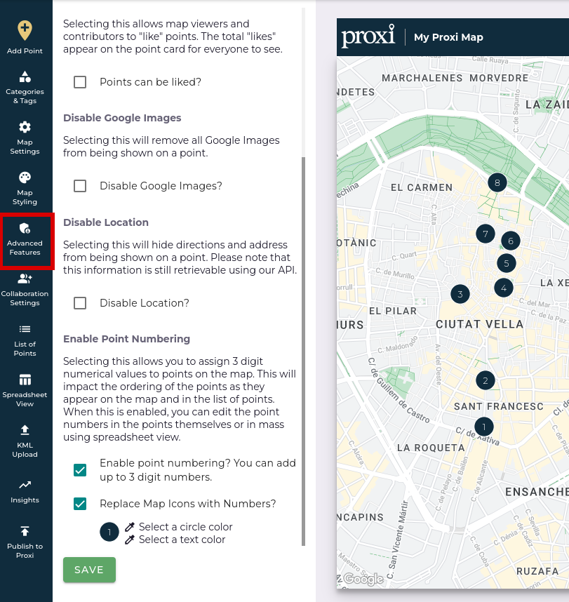

## Publicación

Finalmente le damos a *Publish tono proxi* para poder publicar en plano y hacemos clic en *Save*.

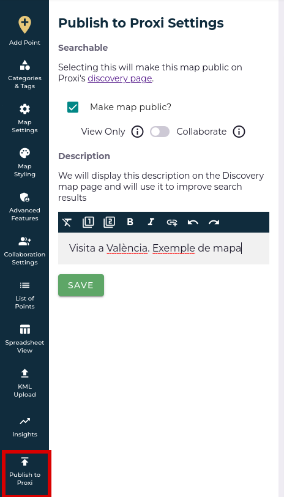

Una vez hecho esto hagamos clic en *Share map* y nos aparecerá la siguiente ventana donde podremos copiar el enlace para que otro puedan ver los nuestro plano:

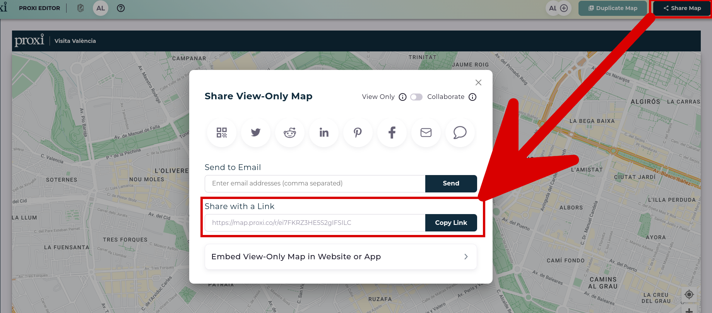

# Bibliografía

(@) [https://map.proxi.co/](https://map.proxi.co/)
(@) [https://mapifator.com](https://mapifator.com)